<h1 align=center>
Atmospheric cloud movement modeling with Inter‑Frame Difference Diffusion Model
</h1>

> Towards High-Fidelity and Temporal-Consistency Generation for Radar Echo Perception Via Differential Diffusion Model
> 
> Junyi Li, Beibei Jin, Xiaohui Song, Jianye Wang, JinDong Li, Pengfei Zhang 

[Paper]() | [Project Page](https://github.com/azier33/DDM/)

## 📌 Setup
We test our code on Ubuntu 22.04 with a single RTX 4090 GPU.

### Environment 

    git clone https://github.com/azier33/DDM.git
    conda create -n DDM 
    conda activate DDM
    conda install -r requirements.txt

### Datasets
We use the Sevirlr and MovingMnist datasets. See [dataset.md](./data/dataset.md) for detailed data structure.

Please adjust the `dataset` folder path in training and test scripts.

## 📌 Training
Train the DDM Diffusion.
You can set dataset using `--dataset /path/to/sevir` or `--dataset path/to/MM`.

### Trianing

    python script/Trainer_diff.py

If you want to train an no diff method ,you can user the command follow.

    python scripts/Trainer_wo_diff.py

### Evaluation
We had released the pretrained model weight in [DDM](https://huggingface.co/LiJunYi/DDM/tree/main), you can download the files and put them in the path `--/root_dir/DDM/logs/`. 

For evaluation for the diff generation,

    python scripts/cal_diff_score.py

For evaluation for the no_diff generation,

    python scripts/cal_score.py

## 📌 Visualizing
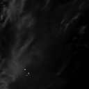
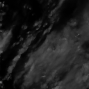
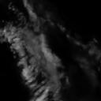
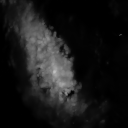
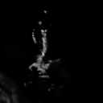

The predicted heat map
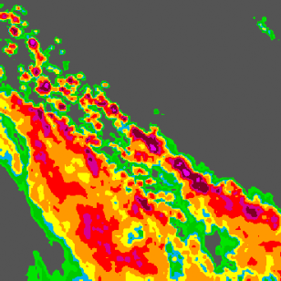
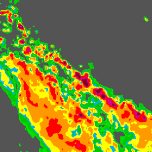
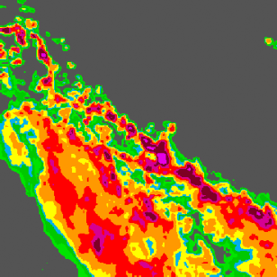
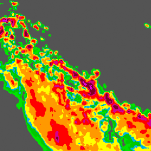
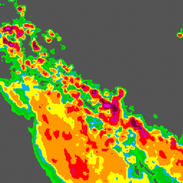

The truth heat map
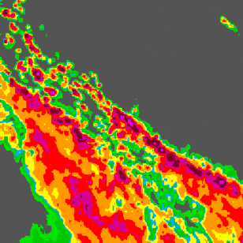
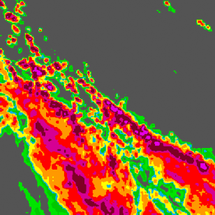
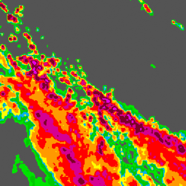
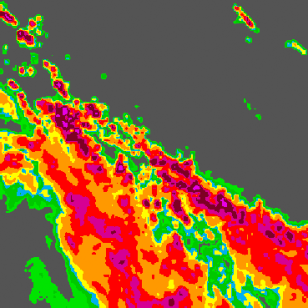
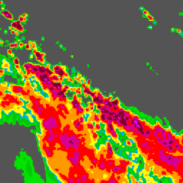

The truth heatmap
To visualize the generation which obtain from model that we pre-trained,

    python scripts/visualize.py
or
    #python scripts/visualize.py

## 📌 Dataset
You can download the dataset that we used in the DDM samed to the [Prediff](https://github.com/gaozhihan/PreDiff) used. 

## Acknowledgement
The code is partly based on [video-diffusion-pytorch](https://github.com/lucidrains/video-diffusion-pytorch), [Diffuser](https://github.com/huggingface/diffusers) and [Prediff](https://github.com/gaozhihan/PreDiff). 

## 📌 License

This project is released under the MIT License.
