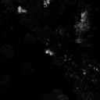

<h1 align=center>
Towards High-Fidelity and Temporal-Consistency Generation for Radar Echo Perception Via 
    
Differential Diffusion Model
</h1>

> Towards High-Fidelity and Temporal-Consistency Generation for Radar Echo Perception Via Differential Diffusion Model
> 
> Junyi Li, Beibei Jin, Xiaohui Song, Jianye Wang, JinDong Li, Pengfei Zhang 

[Paper](https://arxiv.org/abs/2403.07773) | [Project Page](https://sglab.kaist.ac.kr/SemCity)

## 📌 Setup
We test our code on Ubuntu 22.04 with a single RTX 4090 GPU.

### Environment 

    git clone https://github.com/zoomin-lee/SemCity.git
    conda create -n CCDM 
    conda activate CCDM
    conda install -r requirements.txt

### Datasets
We use the Sevirlr and MovingMnist datasets. See [dataset.md](./dataset/dataset.md) for detailed data structure.

Please adjust the `sequences` folder path in `dataset/path_manager.py`.

## 📌 Training
Train the Triplane Autoencoder and then the Triplane Diffusion.
You can set dataset using `--dataset /path/to/sevir` or `--dataset path/to/MM`.
In/outpainting and semantic scene completion refinement are only possible with SemanticKITTI datasets.

### Trianing

    python script/Trainer_diff.py

If you want to train an no diff method ,you can user the command follow.

    python scripts/Trainer_wo_diff.py

### Evaluation

For evaluation for the diff generation,

    python scripts/cal_diff_score.py

For evaluation for the no_diff generation,

    python scripts/cal_score.py

## 📌 Visualizing

To visualize the generation which obtain from model that we pre-trained,

    python scripts/cal_score.py

## 📌 Dataset

We render our scene with [pyrender](https://pyrender.readthedocs.io/en/latest/index.html) and then evaluate it using [torch-fidelity](https://github.com/toshas/torch-fidelity). 

## Acknowledgement
The code is partly based on [guided-diffusion](https://github.com/openai/guided-diffusion), [Sin3DM](https://github.com/Sin3DM/Sin3DM) and [scene-scale-diffusion](https://github.com/zoomin-lee/scene-scale-diffusion). 

## Bibtex
If you find this code useful for your research, please consider citing our paper:

    @inproceedings{lee2024semcity,
        title={SemCity: Semantic Scene Generation with Triplane Diffusion},
        author={Lee, Jumin and Lee, Sebin and Jo, Changho and Im, Woobin and Seon, Juhyeong and Yoon, Sung-Eui},
        booktitle={Proceedings of the IEEE/CVF conference on computer vision and pattern recognition},
        year={2024}
    }

## 📌 License

This project is released under the MIT License.
